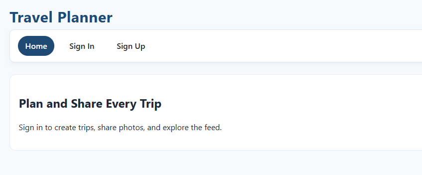

Travel Planner is our take on a social, collaborative travel‑planning app. It allows you to build trips, coordinate with travel partners, and explore trips your friends have taken. The goal was to create something clean, intuitive, and genuinely useful—an app that blends planning, memory‑keeping, and social discovery in one place.

Check out the app here: https://travel-planner-ga.netlify.app/

Technologies used:
React (Vite)
Node.js + Express
MongoDB + Mongoose
JWT Authentication
Google Cloud (for images)
Netlify (front‑end deployment)
Heroku (Back-End Deployment)